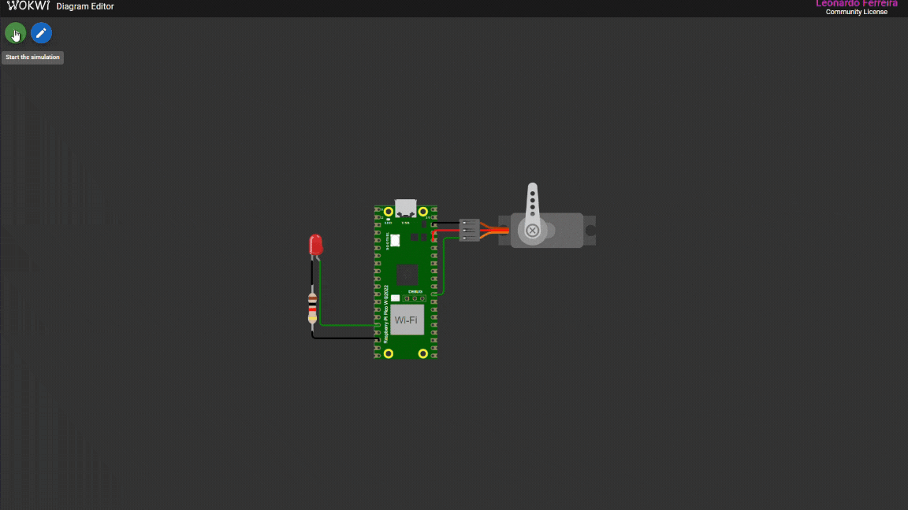

# Projeto de Sistemas Operacionais - PWM

Este projeto controla um **servo motor** e um **LED** usando **PWM** no Raspberry Pi Pico. O servo se move entre 0° e 180° suavemente, e o LED varia seu brilho usando PWM. 

## Descrição do projeto

O objetivo deste projeto é configurar a GPIO **22** para controlar um **servo motor** e a GPIO **12** para controlar um **LED**. A movimentação do servo é realizada de forma suave entre **0°, 90° e 180°**. O LED possui um controle de intensidade baseado em **PWM**.

## Execução do programa

Execução do programa usando servo motor:

Execução do programa usando LED RGB:

## Requisitos

Para rodar este projeto, você precisará de:
- **Raspberry Pi Pico**
- **Servo Motor**
- **LED RGB**
- **Software para compilação do Pico SDK**
- **CMake e Make**
- **Plugin do Raspberry Pi Pico no Visual Studio Code**
- **Simulador Wokwi no Visual Studio Code**

## Funcionalidades
**Movimentação do Servo Motor**
   - Posições fixas: **0°, 90°, 180°**
   - Movimentação suave entre **0° ↔ 180°**  
   
**Controle do LED com PWM**
   - LED altera o brilho de **0% a 100%**  
   
**Compatível com Simulação**
   - Pode ser testado no **Wokwi** antes de rodar no hardware  

## Como compilar e executar
1. Configure o PICO-SDK no seu ambiente de desenvolvimento usando a extensão Raspberry Pi Pico no Visual Studio Code.
2. Abra o arquivo correspondente no Visual Studio Code.
3. Compile o firmware usando o botão de compilação no Visual Studio Code.
4. Conecte a placa BitDogLab ao computador no modo BOOTSEL.
5. Clique no botão denominado "run" no Visual Studio Code para carregar o firmware na placa.
6. A placa executará automaticamente o firmware.

## Vídeo de apresentação
Link: [https://drive.google.com/file/d/1rRmONxksA_hv__qLDw2jGQTeOkgAZJSu/view?usp=sharing](https://drive.google.com/file/d/1rRmONxksA_hv__qLDw2jGQTeOkgAZJSu/view?usp=sharing)

## Autor
Leonardo Ferreira Lima

Email: ferreiiratech@gmail.com